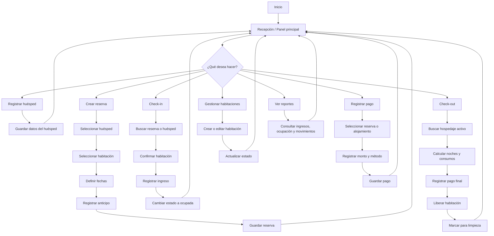
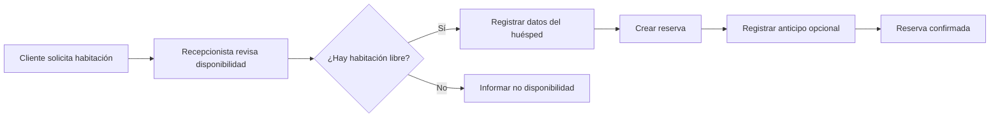
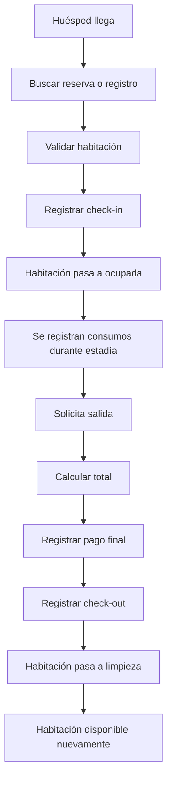
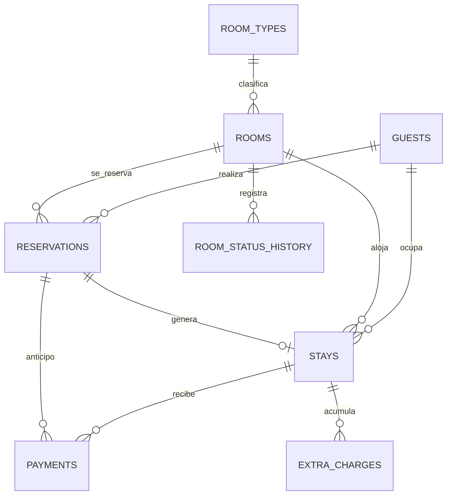

# Sistema de Alojamiento Local

## Descripción

Este proyecto busca crear un **sistema de gestión de alojamientos** que reemplace el uso de **cuadernos físicos**, permitiendo registrar de forma digital toda la operación diaria de un hospedaje.

La idea inicial está enfocada en **alojamientos pequeños** como:

* hostales
* residenciales
* alojamientos familiares
* hoteles pequeños
* moteles

pero con una arquitectura pensada para que en el futuro pueda crecer y adaptarse a **cadenas de alojamientos grandes**.

El sistema será **local**, funcionando en una computadora del negocio, usando **SQLite** como base de datos principal. El frontend estará desarrollado con **React**, y el backend se definirá más adelante según las necesidades del proyecto.

---

## Problema que resuelve

Muchos alojamientos pequeños aún trabajan con:

* cuadernos para anotar ingresos y salidas
* registros manuales de huéspedes
* control informal de habitaciones
* cuentas hechas a mano
* reportes poco claros
* riesgo de pérdida de información

Esto genera problemas como:

* errores en reservas y ocupaciones
* habitaciones asignadas dos veces
* dificultad para saber qué habitaciones están libres
* mala trazabilidad de pagos
* poca seguridad de la información
* lentitud en la atención al cliente

Este sistema busca solucionar eso con una herramienta simple, local, rápida y fácil de usar.

---

## Objetivo general

Desarrollar un sistema local de gestión de alojamientos que permita administrar:

* habitaciones
* huéspedes
* reservas
* check-in y check-out
* pagos
* consumos adicionales
* limpieza y estado de habitaciones
* reportes básicos

con una interfaz moderna, intuitiva y preparada para seguir creciendo.

---

## Alcance inicial

### Primera etapa: alojamientos pequeños

En esta primera versión el sistema estará enfocado en operaciones básicas pero importantes:

* registrar huéspedes
* registrar reservas
* asignar habitaciones
* controlar entradas y salidas
* registrar pagos
* consultar habitaciones disponibles
* llevar historial de ocupación
* reemplazar el cuaderno físico

### Visión futura

Más adelante el sistema podría crecer para incluir:

* múltiples sucursales
* múltiples usuarios con roles
* sincronización en red
* reportes avanzados
* facturación
* integración con lectores de documentos
* dashboard gerencial
* estadísticas por sede
* respaldo en nube opcional

---

## Tecnologías planteadas

### Frontend

* **React**
* **TypeScript**
* **Vite**
* CSS / Tailwind / componente UI a definir

### Base de datos

* **SQLite**

### Backend

Por definir en una siguiente etapa. Algunas opciones viables:

* Node.js + Express
* Node.js + Fastify
* Electron + backend embebido
* Tauri + backend ligero

---

## ¿Por qué SQLite?

SQLite es ideal para la primera etapa porque:

* no requiere instalación compleja de servidor
* funciona localmente
* es liviano y rápido
* permite un despliegue sencillo
* es perfecto para pequeños negocios
* facilita pruebas y prototipos

Esto encaja muy bien con la idea de un sistema que pueda ejecutarse en una PC local del alojamiento.

---

## Módulos principales del sistema

### 1. Gestión de habitaciones

Permite:

* registrar habitaciones
* definir número o código
* definir tipo de habitación
* precio por noche
* estado actual
* capacidad
* observaciones

Estados posibles:

* disponible
* ocupada
* reservada
* limpieza
* mantenimiento
* fuera de servicio

### 2. Gestión de huéspedes

Permite registrar:

* nombre completo
* documento de identidad
* teléfono
* nacionalidad
* dirección
* observaciones

### 3. Reservas

Permite:

* crear reserva
* asignar fechas
* asociar huésped
* asociar habitación
* registrar anticipo
* cambiar estado de reserva

Estados posibles:

* pendiente
* confirmada
* cancelada
* finalizada
* no_show

### 4. Check-in

Permite:

* confirmar llegada del huésped
* asignar habitación definitiva
* registrar fecha y hora de ingreso
* registrar cantidad de personas
* registrar saldo inicial

### 5. Check-out

Permite:

* registrar salida
* calcular total de estadía
* agregar consumos extra
* validar pago final
* liberar habitación

### 6. Pagos

Permite:

* registrar anticipos
* registrar pagos parciales
* registrar pago final
* manejar métodos de pago
* ver historial de pagos

Métodos posibles:

* efectivo
* transferencia
* QR
* tarjeta

### 7. Consumos adicionales

Permite registrar extras como:

* bebidas
* alimentos
* lavandería
* uso de servicios adicionales
* multas o cargos extra

### 8. Limpieza y mantenimiento

Permite:

* marcar habitación para limpieza
* registrar observaciones
* marcar mantenimiento
* bloquear habitación temporalmente

### 9. Reportes básicos

Permite obtener:

* habitaciones ocupadas
* habitaciones disponibles
* ingresos del día
* reservas activas
* historial de huéspedes
* ocupación por fechas

---

## Flujo general del sistema



---

## Flujo específico de una reserva



---

## Flujo específico de check-in y check-out



---

## Propuesta de arquitectura inicial

### Opción simple para comenzar

* **Frontend React** para la interfaz
* **SQLite** para persistencia local
* **Backend local** para lógica de negocio y acceso a base de datos

### Idea de funcionamiento

```text
Usuario (Recepción)
   ↓
Interfaz React
   ↓
Backend local
   ↓
SQLite
```

### Posible evolución futura

```text
Sucursal 1 ─┐
Sucursal 2 ─┼── API central / sincronización
Sucursal 3 ─┘
             ↓
        Base de datos central
```

---

## Diseño inicial de base de datos

A continuación se presenta una idea inicial de las tablas principales.

### Tabla: rooms

Guarda la información de las habitaciones.

| Campo           | Tipo       | Descripción                   |
| --------------- | ---------- | ----------------------------- |
| id              | INTEGER PK | Identificador único           |
| room_number     | TEXT       | Número o código de habitación |
| room_type_id    | INTEGER FK | Tipo de habitación            |
| capacity        | INTEGER    | Capacidad de personas         |
| price_per_night | REAL       | Precio por noche              |
| status          | TEXT       | Estado actual                 |
| floor           | TEXT       | Piso o sector                 |
| notes           | TEXT       | Observaciones                 |
| created_at      | TEXT       | Fecha de creación             |
| updated_at      | TEXT       | Fecha de actualización        |

### Tabla: room_types

Permite clasificar habitaciones.

| Campo         | Tipo       | Descripción     |
| ------------- | ---------- | --------------- |
| id            | INTEGER PK | Identificador   |
| name          | TEXT       | Nombre del tipo |
| description   | TEXT       | Descripción     |
| default_price | REAL       | Precio base     |

Ejemplos:

* simple
* doble
* matrimonial
* triple
* suite

### Tabla: guests

Guarda los datos de los huéspedes.

| Campo           | Tipo       | Descripción            |
| --------------- | ---------- | ---------------------- |
| id              | INTEGER PK | Identificador          |
| full_name       | TEXT       | Nombre completo        |
| document_type   | TEXT       | Tipo de documento      |
| document_number | TEXT       | Número de documento    |
| phone           | TEXT       | Teléfono               |
| email           | TEXT       | Correo                 |
| nationality     | TEXT       | Nacionalidad           |
| address         | TEXT       | Dirección              |
| notes           | TEXT       | Observaciones          |
| created_at      | TEXT       | Fecha de creación      |
| updated_at      | TEXT       | Fecha de actualización |

### Tabla: reservations

Guarda reservas hechas antes del ingreso.

| Campo          | Tipo       | Descripción               |
| -------------- | ---------- | ------------------------- |
| id             | INTEGER PK | Identificador             |
| guest_id       | INTEGER FK | Huésped principal         |
| room_id        | INTEGER FK | Habitación reservada      |
| check_in_date  | TEXT       | Fecha prevista de ingreso |
| check_out_date | TEXT       | Fecha prevista de salida  |
| adults         | INTEGER    | Cantidad de adultos       |
| children       | INTEGER    | Cantidad de niños         |
| status         | TEXT       | Estado de la reserva      |
| source         | TEXT       | Canal de reserva          |
| notes          | TEXT       | Observaciones             |
| created_at     | TEXT       | Fecha de creación         |
| updated_at     | TEXT       | Fecha de actualización    |

### Tabla: stays

Representa la estadía real del huésped.

| Campo          | Tipo            | Descripción                  |
| -------------- | --------------- | ---------------------------- |
| id             | INTEGER PK      | Identificador                |
| reservation_id | INTEGER FK NULL | Reserva asociada si existe   |
| guest_id       | INTEGER FK      | Huésped principal            |
| room_id        | INTEGER FK      | Habitación ocupada           |
| check_in_at    | TEXT            | Fecha y hora real de ingreso |
| check_out_at   | TEXT            | Fecha y hora real de salida  |
| nights         | INTEGER         | Noches cobradas              |
| guest_count    | INTEGER         | Cantidad total de huéspedes  |
| status         | TEXT            | Estado de la estadía         |
| subtotal       | REAL            | Subtotal hospedaje           |
| extras_total   | REAL            | Total extras                 |
| total_amount   | REAL            | Total general                |
| balance_due    | REAL            | Saldo pendiente              |
| notes          | TEXT            | Observaciones                |
| created_at     | TEXT            | Fecha de creación            |
| updated_at     | TEXT            | Fecha de actualización       |

### Tabla: payments

Guarda los pagos realizados.

| Campo          | Tipo            | Descripción               |
| -------------- | --------------- | ------------------------- |
| id             | INTEGER PK      | Identificador             |
| reservation_id | INTEGER FK NULL | Reserva asociada          |
| stay_id        | INTEGER FK NULL | Estadía asociada          |
| amount         | REAL            | Monto pagado              |
| payment_method | TEXT            | Método de pago            |
| payment_type   | TEXT            | Anticipo, parcial o final |
| reference      | TEXT            | Referencia o comprobante  |
| paid_at        | TEXT            | Fecha y hora del pago     |
| notes          | TEXT            | Observaciones             |

### Tabla: extra_charges

Registra consumos o cargos adicionales.

| Campo         | Tipo       | Descripción       |
| ------------- | ---------- | ----------------- |
| id            | INTEGER PK | Identificador     |
| stay_id       | INTEGER FK | Estadía asociada  |
| concept       | TEXT       | Concepto          |
| quantity      | INTEGER    | Cantidad          |
| unit_price    | REAL       | Precio unitario   |
| total         | REAL       | Total             |
| registered_at | TEXT       | Fecha de registro |
| notes         | TEXT       | Observaciones     |

### Tabla: room_status_history

Permite guardar el historial de cambios de estado de una habitación.

| Campo           | Tipo       | Descripción      |
| --------------- | ---------- | ---------------- |
| id              | INTEGER PK | Identificador    |
| room_id         | INTEGER FK | Habitación       |
| previous_status | TEXT       | Estado anterior  |
| new_status      | TEXT       | Nuevo estado     |
| changed_at      | TEXT       | Fecha del cambio |
| reason          | TEXT       | Motivo           |

### Tabla: users

Pensada para una futura gestión de acceso.

| Campo         | Tipo       | Descripción        |
| ------------- | ---------- | ------------------ |
| id            | INTEGER PK | Identificador      |
| full_name     | TEXT       | Nombre del usuario |
| username      | TEXT       | Usuario            |
| password_hash | TEXT       | Contraseña cifrada |
| role          | TEXT       | Rol                |
| is_active     | INTEGER    | Activo o no        |
| created_at    | TEXT       | Fecha de creación  |

Roles posibles:

* admin
* recepcion
* supervisor

---

## Relación conceptual de tablas



---

## Reglas de negocio iniciales

1. Una habitación no puede estar ocupada por más de una estadía activa al mismo tiempo.
2. Una habitación en mantenimiento no puede reservarse.
3. Una habitación en limpieza no debe mostrarse como disponible.
4. Una reserva confirmada puede convertirse en una estadía al hacer check-in.
5. Un check-out debe cerrar la estadía y liberar la habitación.
6. Todo pago debe quedar registrado con fecha, método y monto.
7. Los cargos extra deben sumarse al total final de la estadía.

---

## Funcionalidades mínimas viables (MVP)

La primera versión podría incluir solo esto:

* login local simple
* panel principal
* CRUD de habitaciones
* CRUD de huéspedes
* creación de reservas
* check-in
* check-out
* registro de pagos
* consulta de disponibilidad
* historial básico

Con eso ya se reemplaza una gran parte del trabajo en cuaderno.

---

## Pantallas sugeridas

### 1. Dashboard

* resumen del día
* habitaciones disponibles
* habitaciones ocupadas
* ingresos del día
* reservas de hoy

### 2. Habitaciones

* listado de habitaciones
* filtros por estado
* botón para crear o editar

### 3. Huéspedes

* listado de huéspedes
* búsqueda por nombre o documento
* historial de hospedajes

### 4. Reservas

* crear reserva
* ver reservas activas
* cancelar o editar reserva

### 5. Recepción

* check-in rápido
* check-out rápido
* búsqueda de huésped o reserva

### 6. Pagos

* registrar anticipo
* registrar pago parcial
* registrar pago final
* ver historial

### 7. Reportes

* ocupación diaria
* ingresos por fecha
* historial de movimientos

---

## Estructura inicial del proyecto

```bash
hotel-management-system/
├── README.md
├── package.json
├── public/
├── src/
│   ├── app/
│   ├── components/
│   ├── features/
│   │   ├── rooms/
│   │   ├── guests/
│   │   ├── reservations/
│   │   ├── stays/
│   │   ├── payments/
│   │   └── reports/
│   ├── pages/
│   ├── routes/
│   ├── services/
│   ├── hooks/
│   ├── types/
│   ├── utils/
│   └── main.tsx
└── database/
    ├── schema.sql
    └── seed.sql
```

---

## Ejemplo inicial de esquema SQLite

```sql
CREATE TABLE room_types (
  id INTEGER PRIMARY KEY AUTOINCREMENT,
  name TEXT NOT NULL UNIQUE,
  description TEXT,
  default_price REAL
);

CREATE TABLE rooms (
  id INTEGER PRIMARY KEY AUTOINCREMENT,
  room_number TEXT NOT NULL UNIQUE,
  room_type_id INTEGER,
  capacity INTEGER NOT NULL DEFAULT 1,
  price_per_night REAL NOT NULL,
  status TEXT NOT NULL DEFAULT 'disponible',
  floor TEXT,
  notes TEXT,
  created_at TEXT NOT NULL DEFAULT CURRENT_TIMESTAMP,
  updated_at TEXT,
  FOREIGN KEY (room_type_id) REFERENCES room_types(id)
);

CREATE TABLE guests (
  id INTEGER PRIMARY KEY AUTOINCREMENT,
  full_name TEXT NOT NULL,
  document_type TEXT,
  document_number TEXT,
  phone TEXT,
  email TEXT,
  nationality TEXT,
  address TEXT,
  notes TEXT,
  created_at TEXT NOT NULL DEFAULT CURRENT_TIMESTAMP,
  updated_at TEXT
);

CREATE TABLE reservations (
  id INTEGER PRIMARY KEY AUTOINCREMENT,
  guest_id INTEGER NOT NULL,
  room_id INTEGER NOT NULL,
  check_in_date TEXT NOT NULL,
  check_out_date TEXT NOT NULL,
  adults INTEGER NOT NULL DEFAULT 1,
  children INTEGER NOT NULL DEFAULT 0,
  status TEXT NOT NULL DEFAULT 'pendiente',
  source TEXT,
  notes TEXT,
  created_at TEXT NOT NULL DEFAULT CURRENT_TIMESTAMP,
  updated_at TEXT,
  FOREIGN KEY (guest_id) REFERENCES guests(id),
  FOREIGN KEY (room_id) REFERENCES rooms(id)
);

CREATE TABLE stays (
  id INTEGER PRIMARY KEY AUTOINCREMENT,
  reservation_id INTEGER,
  guest_id INTEGER NOT NULL,
  room_id INTEGER NOT NULL,
  check_in_at TEXT NOT NULL,
  check_out_at TEXT,
  nights INTEGER DEFAULT 1,
  guest_count INTEGER NOT NULL DEFAULT 1,
  status TEXT NOT NULL DEFAULT 'activa',
  subtotal REAL NOT NULL DEFAULT 0,
  extras_total REAL NOT NULL DEFAULT 0,
  total_amount REAL NOT NULL DEFAULT 0,
  balance_due REAL NOT NULL DEFAULT 0,
  notes TEXT,
  created_at TEXT NOT NULL DEFAULT CURRENT_TIMESTAMP,
  updated_at TEXT,
  FOREIGN KEY (reservation_id) REFERENCES reservations(id),
  FOREIGN KEY (guest_id) REFERENCES guests(id),
  FOREIGN KEY (room_id) REFERENCES rooms(id)
);

CREATE TABLE payments (
  id INTEGER PRIMARY KEY AUTOINCREMENT,
  reservation_id INTEGER,
  stay_id INTEGER,
  amount REAL NOT NULL,
  payment_method TEXT NOT NULL,
  payment_type TEXT NOT NULL,
  reference TEXT,
  paid_at TEXT NOT NULL DEFAULT CURRENT_TIMESTAMP,
  notes TEXT,
  FOREIGN KEY (reservation_id) REFERENCES reservations(id),
  FOREIGN KEY (stay_id) REFERENCES stays(id)
);

CREATE TABLE extra_charges (
  id INTEGER PRIMARY KEY AUTOINCREMENT,
  stay_id INTEGER NOT NULL,
  concept TEXT NOT NULL,
  quantity INTEGER NOT NULL DEFAULT 1,
  unit_price REAL NOT NULL DEFAULT 0,
  total REAL NOT NULL DEFAULT 0,
  registered_at TEXT NOT NULL DEFAULT CURRENT_TIMESTAMP,
  notes TEXT,
  FOREIGN KEY (stay_id) REFERENCES stays(id)
);
```

---

## Roadmap sugerido

### Fase 1

* definir requerimientos
* diseñar base de datos
* crear README y documentación inicial
* definir pantallas principales

### Fase 2

* crear frontend base con React
* layout principal
* navegación
* módulos básicos

### Fase 3

* conectar SQLite
* crear operaciones CRUD
* validar lógica de reservas y estadías

### Fase 4

* pagos
* reportes
* limpieza
* estados de habitaciones

### Fase 5

* empaquetado local de escritorio
* respaldos automáticos
* mejora de UX

---

## Posibles mejoras futuras

* soporte para múltiples alojamientos
* múltiples cajas o recepciones
* impresión de comprobantes
* firma digital
* escaneo de documento
* integración con WhatsApp
* envío de comprobantes por correo
* alertas de limpieza
* alertas de reserva por vencer
* reportes exportables a Excel o PDF

---

## Enfoque recomendado para iniciar

Para empezar de forma práctica, lo más recomendable es:

1. diseñar bien el flujo del negocio
2. construir primero el MVP para alojamientos pequeños
3. mantener la base de datos simple pero escalable
4. dejar preparada la estructura para crecer después

La primera meta no debe ser hacer todo, sino resolver lo esencial:

* saber qué habitación está libre
* registrar quién entró
* registrar quién salió
* registrar cuánto pagó
* evitar el uso del cuaderno

---

## Estado del proyecto

🚧 En etapa de análisis y diseño inicial.

---

## Autor

Proyecto en planificación y desarrollo por **Edgar Rojas**.
